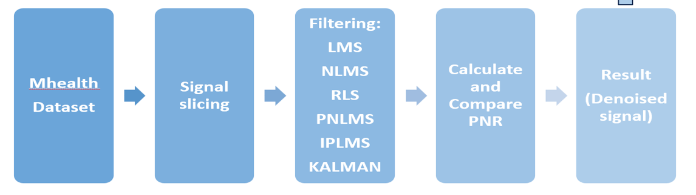

#  Comparative Analysis and Implementation of Adaptive Filter Algorithms for ECG Signal Denoising

---

##  Introduction
- Electrocardiogram (ECG) signals are widely used for monitoring heart activity.
- These signals are highly sensitive to noise such as:
  - Power Line Interference
  - Baseline Drift
  - Motion Artifacts
- Motion artifacts are the most challenging because they overlap with ECG frequency components.
- Traditional filters fail to adapt to time-varying (non-stationary) noise.
- This project uses adaptive filtering techniques to overcome these limitations.

---

##  Project Overview
- This project performs a **comparative analysis of adaptive filtering algorithms** for ECG denoising.

###  Objectives:
- Evaluate multiple adaptive algorithms:
  - LMS
  - NLMS
  - PNLMS
  - IPNLMS
  - RLS
  - Kalman Filter
  - EEMD
- Compare performance using:
  - Signal-to-Noise Ratio (SNR)
  - Mean Squared Error (MSE)
  - Pearson Correlation
- Identify the best algorithm for:
  - Accuracy
  - Computational efficiency
- Enable real-time ECG processing for wearable devices

---

##  Problem Statement
- ECG signals are corrupted by:
  - Power line interference
  - Baseline drift
  - Muscle noise
  - Motion artifacts
- Conventional filters cannot adapt to changing noise conditions.
- This leads to distortion of important ECG features like QRS complex.
- Goal: Develop adaptive filtering methods to improve signal quality.

---

##  History / Background
- Adaptive filtering began with Widrow's LMS algorithm (1975).
- Evolution of algorithms:
  - LMS → Simple but slow
  - NLMS → Improved stability
  - RLS → Fast but complex
  - PNLMS/IPNLMS → Optimized for sparse systems
  - Kalman Filter → Optimal estimation
  - EEMD → Advanced decomposition method
- Growing demand due to wearable healthcare devices.

---

##  Methodology
- Data acquisition (ECG + accelerometer)
- Signal segmentation:
  - Rest (Clean)
  - Walking (Moderate noise)
  - Running (High noise)
- Apply adaptive filtering algorithms
- Evaluate using performance metrics
- Compare results

---

##  Block Diagram

---

## Algorithms Used

###  LMS (Least Mean Squares)
- Simple algorithm
- Low computational cost
- Slow convergence

###  NLMS (Normalized LMS)
- Improved version of LMS
- Faster convergence
- Stable for varying signals

###  RLS (Recursive Least Squares)
- Very fast convergence
- High computational complexity

###  PNLMS / IPNLMS
- Best for sparse systems
- High accuracy in noise removal
- Preserves ECG waveform

###  Kalman Filter
- Optimal estimation technique
- Handles dynamic noise effectively

###  EEMD
- Decomposes signal into components
- High accuracy but slow processing

---

##  Steps of the Project
- Select dataset (mHealth dataset)
- Preprocess ECG signals
- Segment signals based on activity
- Implement adaptive filters
- Calculate performance metrics
- Compare results
- Visualize waveform reconstruction

---

##  Results & Analysis

- Best Performing Algorithms:
  - IPNLMS
  - Kalman Filter
- Fastest Algorithm:
  - NLMS
- Worst Performance:
  - LMS

###  Key Observations:
- PNLMS/IPNLMS preserved ECG waveform effectively
- Kalman filter showed strong robustness
- LMS showed slow convergence
- EEMD is not suitable for real-time applications

---

##  Conclusion
- Adaptive filtering significantly improves ECG signal quality.
- IPNLMS and Kalman filters provide best performance.
- PNLMS/IPNLMS offer optimal balance between:
  - Accuracy
  - Computational cost
- Suitable for real-time wearable ECG systems.

---

##  Future Scope
- FPGA / Embedded implementation
- Integration with IoT healthcare systems
- Multi-sensor fusion (ECG + Gyroscope + Accelerometer)
- AI-based adaptive filtering
- Development of specialized datasets

---

##  Dataset Details
- Dataset: mHealth Dataset
- Sampling Rate: 50 Hz
- Signals:
  - ECG
  - 3-axis accelerometer
- Activities:
  - Rest
  - Walking
  - Running

---

##  Result Summary Table

| Algorithm | Accuracy | Speed | Complexity |
|----------|--------|------|-----------|
| LMS | Low | Fast | Low |
| NLMS | Medium | Very Fast | Low |
| RLS | High | Medium | High |
| PNLMS/IPNLMS | Very High | Fast | Medium |
| Kalman | Very High | Medium | High |

---

##  References
- Widrow, B. – Adaptive Noise Cancelling (1975)
- PhysioNet / mHealth Dataset
- IEEE Research Papers on ECG Denoising

---
## 📜 License

This project is licensed under the **MIT License**.

---

## 🙌 Acknowledgment

Developed as part of **GEN-AI**  
KLE Technological University

---

## ⭐ Support

If you like this project, give it a ⭐ on GitHub!
